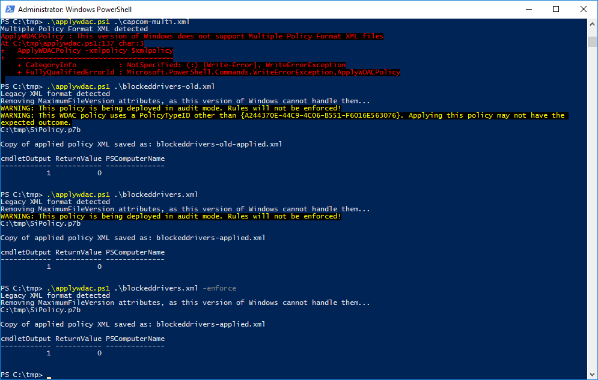
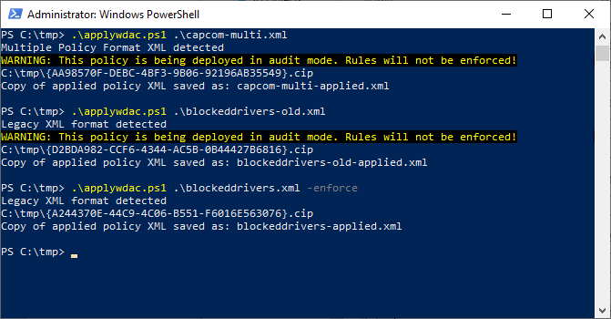
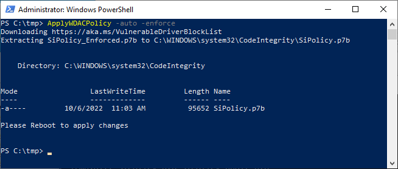

# ApplyWDACPolicy

`applywdac.ps1` is a PowerShell script for applying WDAC policies,
such as the [Microsoft recommended driver block
rules](https://learn.microsoft.com/en-us/windows/security/threat-protection/windows-defender-application-control/microsoft-recommended-driver-block-rules).
This script is designed for use on systems that do **NOT** currently
have WDAC policies and associated management tools in place. If you
are already using WDAC, you should merge WDAC policies using whichever
tools and methods you already have in place. The target audience of
this script are those who want to be able to apply WDAC rules easily,
without requiring extensive knowledge of WDAC.

## Installation

If you have the ability to run stand-along PowerShell scripts, simply
run the `.\applywdac.ps1` script from a PowerShell prompt that is
running with administrative privileges. Alternatively, you can paste
the contents of
[applywdac.ps1](https://raw.githubusercontent.com/wdormann/applywdac/main/applywdac.ps1)
into a PowerShell prompt that is running with administrative
privileges and subsequently run `ApplyWDACPolicy` with the appropriate
arguments. Just be sure to use **`Ctrl+V` on your keyboard** to do the
pasting, as pasting via right-click or even the edit menu at the top
will interpret pasted content on a line-by-line basis as opposed to in
block mode.

## Usage

```
# Import `blockeddrivers.xml` in whatever mode it specifies. e.g. the [Microsoft recommended driver block rules](https://learn.microsoft.com/en-us/windows/security/threat-protection/windows-defender-application-control/microsoft-recommended-driver-block-rules) are in audit mode by default.
PS> .\applywdac.ps1 -xmlpolicy blockeddrivers.xml

# Import `blockeddrivers.xml`, stripping out any "audit" options (therefore applying it in "enforcing" mode)
PS> .\applywdac.ps1 -xmlpolicy blockeddrivers.xml -enforce

# Same as above, but in "paste into PowerShell mode"
PS> <paste applywdac.ps1 contents into PowerShell and press `Enter`>
PS> ApplyWDACPolicy -xmlpolicy blockeddrivers.xml -enforce

# "paste into PowerShell mode" automatically download and install compiled policy binary from Microsoft
PS> <paste applywdac.ps1 contents into PowerShell and press `Enter`>
PS> ApplyWDACPolicy -auto -enforce
```

Pre-Windows-1903 example usage:


Windows 1903 or later example usage:


Automatic download from Microsoft example usage, "paste into PowerShell" invocation:


## HVCI Notes

If you apply the [Microsoft recommended driver block
rules](https://learn.microsoft.com/en-us/windows/security/threat-protection/windows-defender-application-control/microsoft-recommended-driver-block-rules),
you may end up with
[HVCI](https://learn.microsoft.com/en-us/windows/security/threat-protection/device-guard/enable-virtualization-based-protection-of-code-integrity)
enabled on your system. While HVCI is an excellent mitigation against
attacks and it should be used on every platform that can support it,
there can be some edge cases where HVCI can interfere with the ability
to use a system as intended. For example, a machine where VMware
Workstation is installed and nested virtualization features are
needed. In such cases, it may be necessary to disable HVCI to regain
the ability to use the VMware Workstation native hypervisor. VMware
has provided [instructions for how this can be
accomplished](https://kb.vmware.com/s/article/2146361).

Note that driver blocking with WDAC will still function as expected,
even when HVCI is disabled.

## Undoing the changes made by this utility

You may encounter a situation where applying the Microsoft recommended
driver block rules policy interferes with something that you want to
do. If this is the case and you're sure that you wish to have a
vulnerable driver on your system, you can undo the changes made by
this script.

### Removing automatic policy installation

For systems that have applied the Microsoft recommended driver block
rules using the `-auto` option, this tool downloads a blocklist binary
from Microsoft and places it as
`%windir%\system32\CodeIntegrity\SiPolicy.p7b`. To undo the driver
policy changes, simply delete this file and reboot.

### Removing manual policy installation

For systems where an XML policy has been installed, this tool places
the compiled policy as
`%windir%\system32\CodeIntegrity\CIPolicies\Active\{PolicyId}.cip`,
where `PolicyId` is the GUID of the policy that you have applied. To
undo the driver policy changes, simply delete this file and reboot.


## Contributing

Pull requests are welcome. For major changes, please
open an issue first to discuss what you would like to change.

Please make sure to update tests as appropriate.

## License
[BSD](https://choosealicense.com/licenses/bsd-2-clause/)
